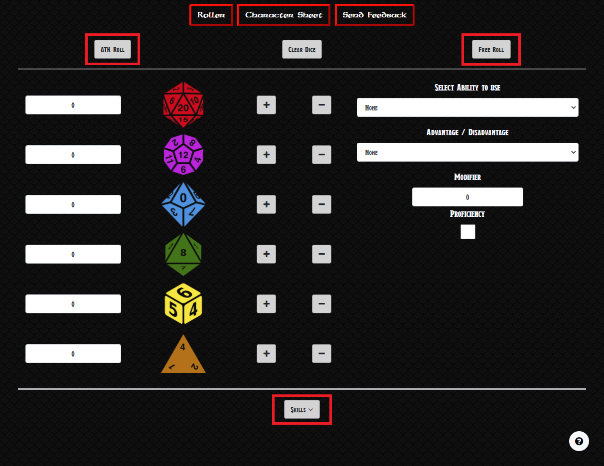
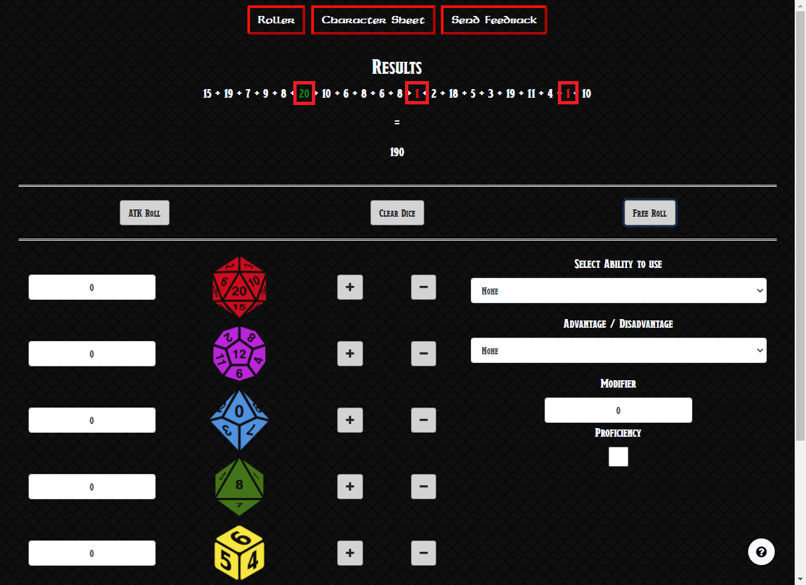
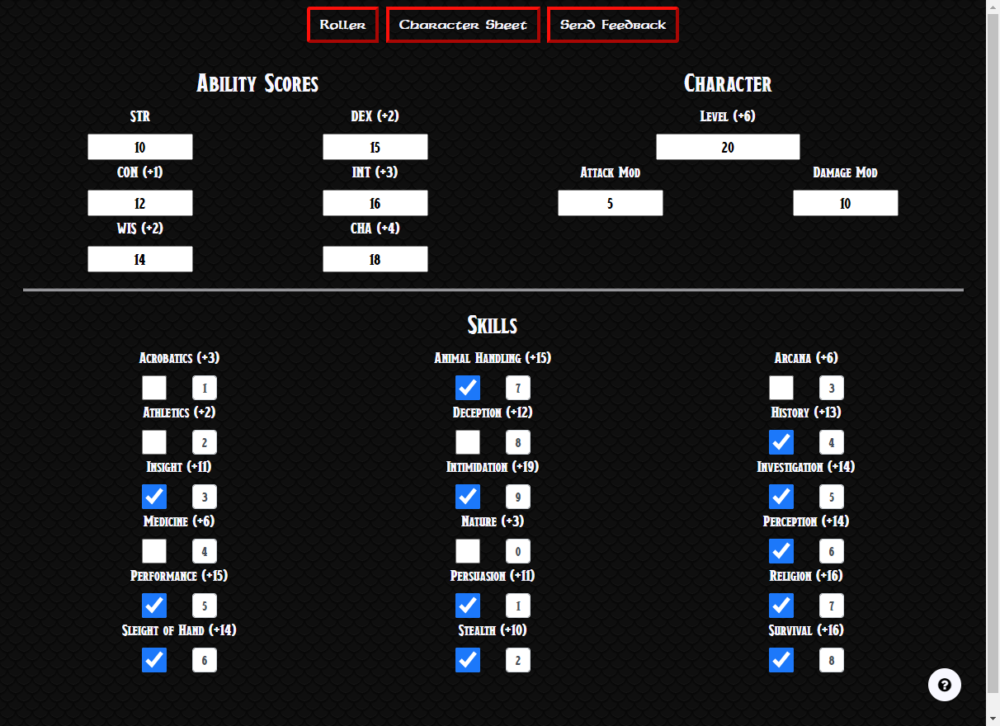
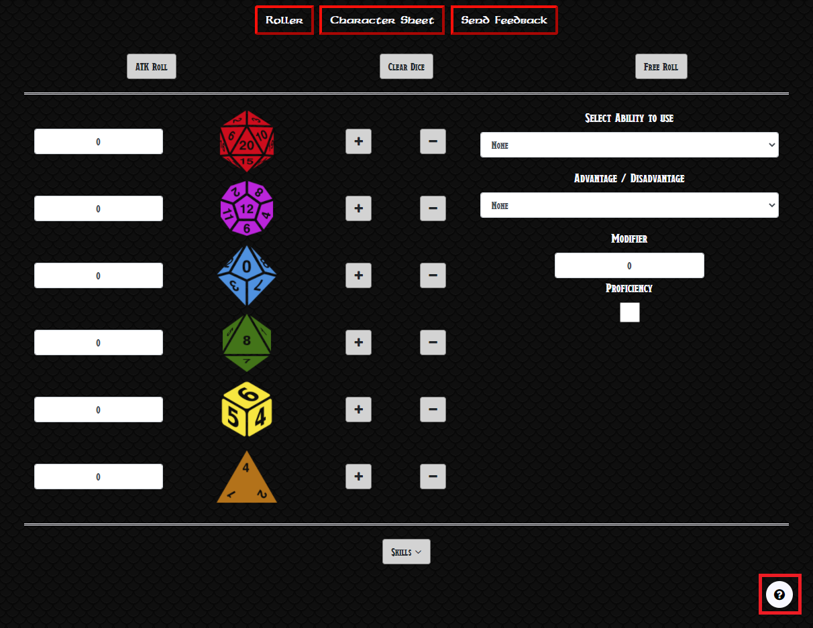
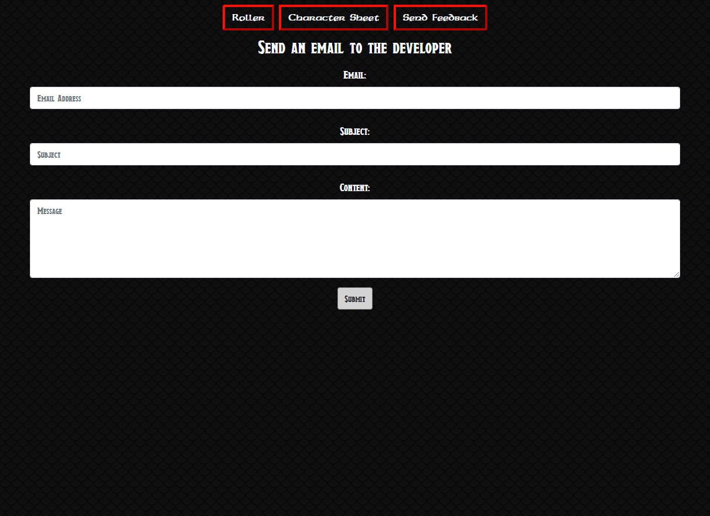

Go back to original [document](https://github.com/JuanBrachoDev/DnD-Roller/tree/master/docs/readme/readme.md).

### Validation

---

The W3C Markup Validator, W3C CSS Validator Services, JSHint and Chrome Lighthouse were used to validate and test every page and JavaScript file of the project to ensure there were no errors. 

-   [W3C Markup Validator](https://validator.w3.org/#validate_by_input) - [Results](https://github.com/JuanBrachoDev/DnD-Roller/tree/master/docs/validation/html)
    >   Results achieved after fixing accessibility issues, specifically missing **aria-label**(s) in input fields across all pages. Ignoring warnings in index.html as adding headers would not fit the design of the page.
-   [W3C CSS Validator](https://jigsaw.w3.org/css-validator/#validate_by_input) - [Results](https://github.com/JuanBrachoDev/DnD-Roller/tree/master/docs/validation/css)
    >   All CSS filed validated successfully.
-   [JSHint](https://jshint.com/) - [Results](https://github.com/JuanBrachoDev/DnD-Roller/tree/master/docs/validation/js)
    >   Results show unused variables and functions but ignoring those warnings as the functions are not used within the same file and some variables return undefined since they take values from other files as well.
-   [Google Chrome Lighthouse](https://developers.google.com/web/tools/lighthouse) - [Results](https://github.com/JuanBrachoDev/DnD-Roller/tree/master/docs/validation/lighthouse)
    >   Initially the tests showed issues with performance while advising to pre-load the style file with fonts in it. So added preload links to common.css in all three pages and results were satisfactory.

### Responsiveness

---

The main tool to test all pages for responsiveness was Chrome DevTools. Personal devices were used as well.

Here is a list of all devices tested:

| Mobile | Tablet | Desktop |
| :-: | :-: | :-: |
| Moto G4 | iPad | Acer (27") - 16:9 |
| Galaxy S5/J7 | iPad Pro | MacBook Pro (15") |
| Pixel 2/2 XL | iPad Mini | |
| iPhone 5/SE | Kindle Fire | |
| iPhone 6/7/8 | | |
| iPhone 6/7/8 Plus | | |
| iPhone X | | |

### Testing User Stories from User Experience (UX) Section

---

-   #### As a player I need to:

    - Be able to roll dice for attack, damage, and skill rolls.
        > I can select the required modifiers and easily access **attack rolls** by clicking the "ATK Roll" button in the Roller page, **damage rolls** by selecting the dice I need and clicking the "Free Roll", and **skill rolls** by clicking the "Skills" dropdown and selecting the one I need.
        

    - Be able to easily tell if my dice rolls are either the best or the worst.
        > Whenever a dice is rolled I can see that the **best rolls** are highlighted in green and the **worst** in red.
        

    - Be able to store my character's stats so I can easily return to it between sessions.
        > I can **input** my character's most important stats into the Character Sheet page to calculate important modifiers, and they **stay in place** even if I reopen the page later.
        

    - Be able to understand the interface if I don't have much experience with DnD.
        > There is a help button on the bottom right of the page that gives me **a quick rundown** of both the Roller and Character Sheet pages.
        

    - Be able to send feedback back to the developer in case I need anything else readily available in my dice roller.
        > I can **send an email** to the Developer by filling the form in the Send Feedback page with any suggestion or bug I found.
        

### Functionality Testing

---

The following features were tested for **index.html**:

| Feature | Expected Behaviour | Testing Method | Result |
| :-: | :-: | :-: | :-: |
| Button Menu | All buttons have a mouseover animation and link correctly. | Hovered the mouse over the buttons and clicked on each button. | Passed |
| Burger Menu | Menu drop downs from main button and all buttons link correctly. | Deployed menu and clicked on each link. | Passed |
| Dice Inputs | Should only accept values between 0 and 30 and round down to integer if any decimal is input. If any invalid value is entered it should default back to 0. | Entered negative numbers, strings, decimal numbers, and integers. | Passed |
| Dice Add Buttons | Should add 1 dice to their respective row, while not allowing the value to go over 30. | Clicked the button and tried to go over 30. | Passed |
| Dice Subtract Buttons | Should subtract 1 dice to their respective row, while not allowing the value to go under 0. | Clicked the button and tried to go under 0. | Passed |
| Ability Modifier Selection Menu | Should add the stored value for ability score modifiers in Local Storage (if any) to both ATK Roll and Free Rolls. | Tried ATK Roll and Free Roll with each of the modifiers before and after modifiers were stored, including "None". | Passed |
| Advantage/Disadvantage Selection Menu | Should roll a single d20 on ATK Rolls if "None is selected", 2d20 and select the higher for Advantage, 2d20 and select the lower for Disadvantage. | Added console logs to `rollAdvantageOrDisadvantage()` in index init.js, printing all dice rolls to check that it was picking the higher/lower number in each case. | Passed |
| Modifier Text Input | Should only accept values between -50 and 50 and round down to integer if any decimal is input. If any invalid value is entered it should default back to 0. Then it should add this value to ATK and Free Rolls. | Entered negative numbers, strings, decimal numbers, integers and then tested on both ATK and Free Rolls. | Passed |
| Proficiency Checkbox | Should add the stored value for proficiency modifier in Local Storage (if any) to both ATK Roll and Free Rolls. | Ticked and unticked while trying both rolls before and after a value was stored. | Passed |
| Skills Buttons | Main button should show the dropdown with all of the skills, and each skill should call its function and fetch the associated modifier in Local Storage. | Clicked on each skill and verified that it was rolling dice correctly and adding the modifier associated with them (if any). | Passed |
| ATK Roll Button | Should roll 1d20 by default and add selected modifiers, including Advantage/Disadvantage accordingly. | Tried rolling by itself at first and added different combination of modifiers thereafter. | Passed |
| Free Roll Button | Should roll all dice selected and nothing if no dice are chosen. Then it should add all selected modifiers, except for Advantage/Disadvantage. After rolling it should clear all dice selected. | Tried rolling by itself at first and added different combination of dice and modifiers thereafter. Checked if it was clearing the dice selection. | Passed |
| Clear Dice Button | Should clear any dice selected. | Checked if it was clearing all dice correctly. | Passed |
| Tutorial Button | It should start the tutorial and show how most features of the page work, while highlighting each item that it is referring to. | Clicked on the tutorial button and verified that each explanation referred to the element it was highlighting, while making sure all content was displayed and no step was skipped. | Passed |

The following features were tested for **character-sheet.html**:

| Feature | Expected Behaviour | Testing Method | Result |
| :-: | :-: | :-: | :-: |
| Button Menu | All buttons have a mouseover animation and link correctly. | Hovered the mouse over the buttons and clicked on each button. | Passed |
| Burger Menu | Menu drop downs from main button and all buttons link correctly. | Deployed menu and clicked on each link. | Passed |
| Ability Scores | Each input should only accept values between 1 and 30 and round down to integer if any decimal is input. If any invalid value is entered it should show 1. After that, their respective label should show the modifier calculated based on the score. | Entered negative numbers, strings, decimal numbers, and integers. Checked if the modifier was correct according to the formula. | Passed |
| Level Input | Should only accept values between 1 and 20 and round down to integer if any decimal is input. If any invalid value is entered it should default back to showing 1. After that, their respective label should show the modifier calculated based on the score. | Entered negative numbers, strings, decimal numbers, and integers. Checked if the modifier was correct according to the formula. | Passed |
| Attack and Damage Modifier Inputs | Should only accept values between -50 and 50 and round down to integer if any decimal is input. If any invalid value is entered it should default back to showing 0. | Entered negative numbers, strings, decimal numbers, and integers. | Passed |
| Skills | Each skill has a proficiency checkbox and a modifier text input, ticking proficiency should add the proficiency modifier to its label. The modifier should only accept numbers between -50 and 50, if any invalid value is entered it should default back to showing 0. | Entered negative numbers, strings, decimal numbers, and integers in the text input. Ticked and unticked the proficiency checkbox.  | Passed |
| Acknowledgement Ticks | Should appear on blur of an input to let the user know that the value has been entered correctly and stored. | Filled the form and verified that the tick appears on all fields when filled correctly. | Passed |
| Character Sheet Tutorial Button | It should start the tutorial and show how most features of the page work, while highlighting each item that it is referring to. | Clicked on the tutorial button and verified that each explanation referred to the element it was highlighting, while making sure all content was displayed and no step was skipped. | Passed |

    
The following features were tested for **contact.html**:

| Feature | Expected Behaviour | Testing Method | Result |
| :-: | :-: | :-: | :-: |
| Button Menu | All buttons have a mouseover animation and link correctly. | Hovered the mouse over the buttons and clicked on each button. | Passed |
| Burger Menu | Menu drop downs from main button and all buttons link correctly. | Deployed menu and clicked on each link. | Passed |
| Email Form | The form should have all fields filled and a valid email must have been entered in the email field. An email should be sent to the developer's address with all the info in the form. | Tried to send emails with some fields empty, tried to type in an invalid email, and finally filled it correctly to verify that emails are being sent. | Passed |
    
### UX Testing

---

-   The Website was tested on Google Chrome, Microsoft Edge, and Mozilla Firefox browsers.
-   Friends and family members were asked to review the site and documentation to point out any errors, bugs and/or user experience issues.

### Fixed Bugs

---

-   Email form displayed acknowledgement modal before validating input fields.
       > Removed **data-target** and **data-toggle** attributes linked to the modal and added `$("acknowledge-modal").modal()` to function called on form submit.

-   Character Sheet labels showed NaN on first run of the page.
       > Bug occurred after initializing the character sheet fields with their **Local Storage** values. Added functions that checked if any value had been stored in **Local Storage** before fetching said value, and left the field blank if none was found.

-   The Dice images in index.html grew beyond their div on bigger screens and shrunk too much on smaller ones.
       > Added **min height/width** and **max height/width** to the dice while leaving `width: 100%;` and `height: 100%;` so they still adapted to screen size.

-   Checkboxes in character sheet weren't resizing according to their set style in CSS.
       > The checkbox and the text input were arranged using the grid design at first. Had to remove the **.col** classes as bootstrap was overriding the local styles. 

### Known Bugs

---

-   The tutorial tooltip sometimes clips off the viewport on smaller devices after highlighting an element that might be close to the edge of the screen.
